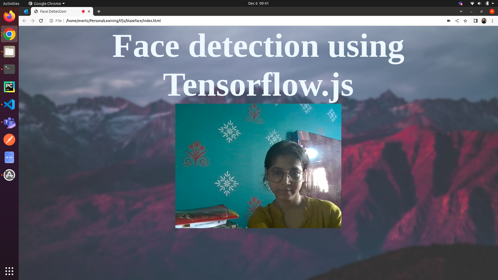

# blazeface

### Explanation
Creating an App using tfjs `blaze_face` model to detect face using webcam in browser

We create a self calling function(IIFE) in which we obtain the canvas and video elements by their id. To get the context for the canvas, we use the getContext() method.

To receive the video feed using the navigator.getUserMedia method and adding the stream to the video source object.

video.play() is used to play the video but since we have set the visibility to false in the video element of the index.html file, the video feed cannot be physically viewed. The feed which is displayed is the canvas. The face predictions are drawn using the canvas context.

To synchronise the video feed and the canvas element, we add an event listener and call a function draw which draws the predictions to it.

Create an asynchronous draw function with parameters as the video feed, context, the width and height of the canvas.
Draw the current frame of the video feed on it. Load the model using await blazeface.load(). Get the predictions on the model await model.estimateFaces() while setting the returnTensors parameter to false. Draw the bounding box on the canvas context using the predictions tensor. Obtain the confidence score using the predictions tensor and add the text to the canvas context relative to the bounding box. To call the draw function repeatedly set the timeout as 250 ms.

Add the working files (index.html, main.css, image_pred.js) to a folder. Name the folder blazeface(or any other name of your choice).

### Result
